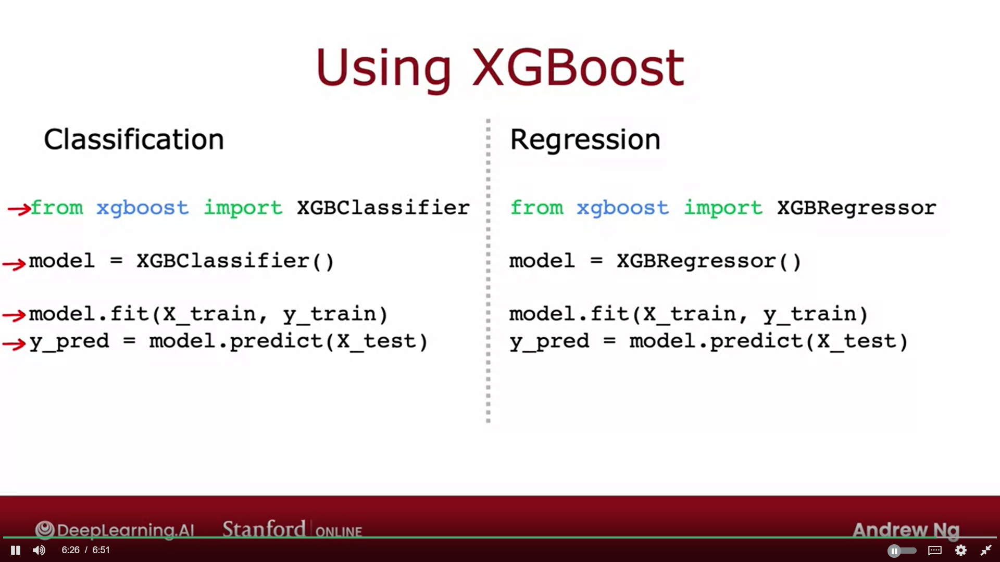

# Hands-on Knowledge
## Categorical Data
Eventhough when I tested the differnce the only difference is the order of columns, the easier use for:
**Labels** = [LabelBinarizer](https://scikit-learn.org/stable/modules/generated/sklearn.preprocessing.LabelBinarizer.html)

## Parameter Shape/Dimensions

Where: <br>
$n^{[l]}$ = Number of neurons in layer $l$
$$
Dim(W^{[l]}) = (n^{[l]}, n^{[l-1]})
$$
$$
Dim(b^{[l]}) = (n^{[l]},1)
$$

# Course Knowledge

# Definitions
- Deep Learning = Neural Networks = Multilayer perceptron
- Handwritten digit classification problem = Binary classification
- Information gain: Reduction of entropy
- **Variables**

$$
\vec{x}^{(i)} = \text{inputs for result set } i
$$

$$
y^{(i)} = \text{value of result set } i
$$

- **Cross Entropy function(For comparing 2 probability distributions)**

$$
L(f(x), y) = -y \log(f(x)) - (1 - y) \log(1 - f(x))
$$

# Linear Regression

### Estimate Function
$$
f_{\vec{w}, b}(\vec{x}^{(i)} = \vec{w} \cdot \vec{x}^{(i)} + b 
$$

### Loss Function
How well you are doing on **one** training example

$$
L(f_{\vec{w}, b}(\vec{x}^{(i)}),y^{(i)}) = f_{\vec{w}, b}(\vec{x}^{(i)}) - y^{(i)}
$$


### Squared Cost Function
How well you are doing on **all** the training examples

$$
J(\vec{w}, b) = \frac{1}{2m} \sum_{i=1}^{m} \left(f_{\vec{w}, b}(\vec{x}^{(i)}) - y^{(i)} \right)^2 
$$

$$
J(\vec{w}, b) = \frac{1}{2m} \sum_{i=1}^{m} \left(L(f_{\vec{w}, b}(\vec{x}^{(i)}),y^{(i)}) \right)^2 
$$

### Gradient Descent
$$
\vec{w}_j := \vec{w}_j - \alpha \frac{\partial J(\vec{w}, b)}{\partial \vec{w}}, \quad b := b - \alpha \frac{\partial J(\vec{w}, b)}{\partial b} \quad || \quad \alpha= \text {learning rate} \quad\quad j=1..n \text{ where n is number of features}
$$

   - Repeat until convergence criteria are met. **Simultaneously**

#### Derivitive

$$
\frac{\partial J(\vec{w}, b)}{\partial \vec{w}} = \frac{1}{m} \sum_{i=1}^{m} \left(f_{\vec{w}, b}(\vec{x}^{(i)}) - y^{(i)} \right)x^{(i)}
$$

$$
\frac{\partial J(\vec{w}, b)}{\partial b} = \frac{1}{m} \sum_{i=1}^{m} \left(f_{\vec{w}, b}(\vec{x}^{(i)}) - y^{(i)} \right)
$$

# Logistic Regression

### Sigmoid Function:

$$
g(z) = \frac{1}{1+ e^{-z}} = g( \vec{w} . \vec{x} +b) = \frac{1}{1+ e^{-( \vec{w} . \vec{x} +b)}} \quad || \quad 0 < g(z) < 1
$$

### Loss Function

$$
L(h_{\vec{w}, b}(\vec{x}^{(i)}), 1) = -\log(h_{\vec{w}, b}(\vec{x}^{(i)})) \quad\quad || \quad\quad \ y^{(i)} = 1
$$

$$
L(h_{\vec{w}, b}(\vec{x}^{(i)}), 0) = -\log(1 - h_{\vec{w}, b}(\vec{x}^{(i)}))  \quad\quad || \quad\quad \ y^{(i)} = 0
$$

$$
L(h_{\vec{w}, b}(\vec{x}^{(i)}), y^{(i)}) = -y^{(i)} \log(h_{\vec{w}, b}(\vec{x}^{(i)})) - (1 - y^{(i)}) \log(1 - h_{\vec{w}, b}(\vec{x}^{(i)}))
$$

Derivation is from principle called maximum likelyhood estimation
- **Why is the logistic regression loss function different from the linear regression loss function?** <br>
Because when we use previous cost function, there will exist many local minima which the gradient descent can be stuck at it.


credit to Andrew Ng course of Stanford university.

## Regularization
Done to minimize **w** parameters to reduce overfitting by adding an extra term to the cost function

### Regularization Term

$$
\frac{\partial J(\vec{w}, b)}{\partial \vec{w}} = \frac{1}{m} \sum_{i=1}^{m} \left(f_{\vec{w}, b}(\vec{x}^{(i)}) - y^{(i)} \right)x^{(i)}
$$

### Final Cost Function

$$
J(\vec{w}, b) = \frac{1}{2m} \sum_{i=1}^{m} \left(f_{\vec{w}, b}(\vec{x}^{(i)}) - y^{(i)} \right)^2 + \frac{\lambda}{2m} \sum_{j=1}^{n} w_j^2 \quad|| \quad  \lambda = \text{Regularization parameter}
$$

### Derivative

Because according to this Wj all other Ws are constant so are zeroed

$$
\frac{\partial}{\partial w_j} \left( \sum_{j=1}^{m}\frac{\lambda}{2m} w_j^2 \right) = \lambda w_j   \quad || \quad m=\text{number of features}
$$

$$
\frac{\partial J(\vec{w}, b)}{\partial w_j} = \frac{1}{m} \sum_{i=1}^{m} \left(f_{\vec{w}, b}(\vec{x}^{(i)}) - y^{(i)} \right)x^{(i)} + \frac{\lambda}{m} w_j 
$$

# Softmax Regression

- Classification but not binary (multiclass classification)
- If at output layer there are 10 units, then there are 10 classes

## Softmax Regression Function

Given a set of $n$ features $\(\vec{x} = [x_1, x_2, \ldots, x_n]\)$ and $k$ classes, the softmax function for the $j$-th class $(\( j = 1, 2, \ldots, k \))$ is defined as:


where:
- $\vec{x}$ is the input feature vector.
- $\vec{w}_j$ is the weight vector for the $j$-th class.
- $b_j$ is the bias term for the $j$-th class.
- $k$ is the number of classes.

# Key points:
Softmax and Numerical Stability:

## 1. The softmax function converts raw scores (logits) from the model into probabilities.
- If softmax is applied directly in the final output layer, numerical instability can arise (due to large values in logits leading to potential overflow/underflow).
- To avoid this, the softmax function is often applied with the loss function (like SparseCategoricalCrossentropy), which results in more stable training.

## 2. Building the Model:

The final Dense layer uses a 'linear' activation, meaning no activation function is applied to the raw logits. This allows the model to output raw scores (logits) rather than probabilities.
When compiling the model, from_logits=True is specified in the loss function (e.g., tf.keras.losses.SparseCategoricalCrossentropy(from_logits=True)), which tells TensorFlow that the logits are raw and need the softmax applied internally with the loss calculation. This way, you avoid softmax-induced numerical issues during training.

## 3. Using the Model:

The model’s output (raw logits) will not be probabilities. If you want probabilities after training (e.g., for inference), you need to apply softmax manually to convert the logits into probabilities.
By postponing the application of the softmax to the loss function, it helps with stable gradient calculations during backpropagation, especially when the logits are large or small.

### Understanding the Terms

1. **Logits**: These are the raw, unnormalized scores output by the last layer of your neural network. They can be any real numbers, positive or negative.

2. **Softmax Function**: This function converts logits into probabilities that sum to 1. It does this by exponentiating each logit and dividing by the sum of all exponentials. However, this can cause numerical instability with very large or small logits.

3. **Cross-Entropy Loss**: A loss function that measures the difference between two probability distributions—in this case, the predicted probabilities and the true labels.

### The Problem with Applying Softmax Directly

- **Numerical Instability**: Applying softmax directly to logits in the output layer can lead to numerical issues like overflow or underflow. This happens because the exponential function in softmax can produce extremely large or tiny numbers when dealing with large positive or negative logits.

### The Solution: Using `from_logits=True`

When you set `from_logits=True` in your loss function (e.g., `tf.keras.losses.SparseCategoricalCrossentropy(from_logits=True)`), you're instructing TensorFlow to:

1. **Understand that Outputs are Raw Logits**: It knows the model outputs are unnormalized scores and that softmax hasn't been applied yet.

2. **Apply Softmax Internally**: TensorFlow combines the softmax function with the cross-entropy loss in a single, numerically stable operation. This method avoids the intermediate computation of probabilities, which can be unstable.

3. **Enhance Numerical Stability**: By computing the loss in this combined way, TensorFlow reduces the risk of numerical errors during training.

### Why This Matters

- **Stable Training**: Numerical instability can lead to incorrect gradient calculations, causing the training process to fail or converge poorly.

- **Simpler Model Architecture**: By not including the softmax layer in your model, you simplify the architecture and delegate the responsibility of converting logits to probabilities to the loss function during training.

### What Happens Under the Hood

TensorFlow uses a function that combines softmax and cross-entropy in one step, often referred to as `softmax_cross_entropy_with_logits`. This function computes the cross-entropy loss without ever explicitly calculating the softmax probabilities, thus avoiding numerical issues.

### Practical Steps

- **Model Definition**:
  ```python
  # Final layer without activation function
  model.add(Dense(num_classes))  # No activation specified means 'linear' by default
  ```

- **Model Compilation**:
  ```python
  # Specify from_logits=True in the loss function
  loss_fn = tf.keras.losses.SparseCategoricalCrossentropy(from_logits=True)
  model.compile(optimizer='adam', loss=loss_fn, metrics=['accuracy'])
  ```

- **During Training**:
  - The model outputs logits.
  - The loss function internally applies softmax in a stable way.
  - You don't have to worry about numerical issues caused by softmax.

- **During Inference (Making Predictions)**:
  - The model still outputs logits.
  - If you need probabilities, manually apply softmax to the logits.
    ```python
    predictions = model.predict(new_data)
    probabilities = tf.nn.softmax(predictions).numpy()
    ```

### Visualizing the Numerical Stability

Suppose you have logits `[1000, 1001, 999]`. Computing softmax directly:

- Exponentials become `[exp(1000), exp(1001), exp(999)]`, which are huge numbers and can cause overflow.

When TensorFlow handles softmax internally with the loss function:

- It uses mathematical tricks (like subtracting the max logit value) to keep the numbers in a manageable range, preventing overflow.

### Key Takeaways

- **Avoiding Softmax in Output Layer**: By not applying softmax in the model's output layer, you prevent potential numerical instability during training.

- **Using `from_logits=True`**: This tells TensorFlow to handle the logits appropriately within the loss function, ensuring stable and accurate training.

- **Post-Training Predictions**: Since the model outputs logits, you need to apply softmax manually to interpret the outputs as probabilities when making predictions.

### Conclusion

By specifying `from_logits=True` in your loss function, you're improving the numerical stability of your model during training. TensorFlow takes care of combining the softmax function with the loss calculation in a way that avoids the pitfalls of directly applying softmax to logits with large magnitude.


## Softmax Loss Function


## Feature Scaling

Feature scaling is a technique used to standardize the range of independent variables or features in a dataset. It is an important preprocessing step in many machine learning algorithms, especially those that calculate distances between data points, such as k-nearest neighbors (KNN) and support vector machines (SVM), or those that rely on gradient descent optimization, like neural networks.

### Why Feature Scaling is Important

1. **Different Ranges:** Features in a dataset can have different units and scales. For example, one feature might represent age (ranging from 0 to 100), while another represents income (ranging from hundreds to thousands). Without scaling, the feature with the larger range may dominate the model's learning process, leading to biased or suboptimal results.

2. **Improved Convergence:** In algorithms like gradient descent, feature scaling can improve the convergence speed. Scaled features can help the algorithm reach the optimal solution more efficiently.

3. **Distance-Based Algorithms:** Algorithms that compute distances (e.g., KNN, k-means clustering) can be sensitive to the scale of the data. Feature scaling ensures that each feature contributes equally to the distance calculations.

### Common Feature Scaling Techniques

1. **Min-Max Scaling (Normalization):**
   - **Description:** This technique rescales the data to a fixed range, usually [0, 1].
   - **Formula:** $X' = (X - X_min) / (X_max - X_min)$
   - **Use Case:** Useful when you know the bounds of your data.

2. **Standardization (Z-score Normalization):**
   - **Description:** This technique transforms the data to have a mean of 0 and a standard deviation of 1.
   - **Formula:** $X' = (X - μ) / σ$
   - **Use Case:** Useful when the data has outliers or is not bounded, as it retains the influence of outliers.

3. **MaxAbs Scaling:**
   - **Description:** This technique scales each feature by its maximum absolute value, ensuring that the data is within the range [-1, 1].
   - **Formula:** $X' = X / |X_max|$
   - **Use Case:** Useful when the data is sparse or contains negative values.

4. **Robust Scaling:**
   - **Description:** This technique uses the median and the interquartile range (IQR) for scaling.
   - **Formula:** $X' = (X - median) / IQR$
   - **Use Case:** Useful when the data contains outliers.

### How to Choose a Scaling Technique

The choice of scaling technique depends on the nature of your data and the specific requirements of the machine learning algorithm you're using. For example, standardization is often preferred for algorithms that assume normally distributed data, while normalization is useful when the data has a uniform distribution.


## Data Split

#### For Evaluating Performance
**When it is hard to plot the graph of the function**
_We can split the training set into two subsets, a larger part is the training set and another smaller set is the test set_ <br>
**This actually has an overly optimistic estimate of the generalization error on the training data since we choose a model, changing the function's degree of polynomial then check the $J_test$** <br>
_So we instead split the data set into **3** sets 1.Training set 2.Cross validation set(Development set) 3.Test set_
```python
x_train, x_test, y_train, y_test = train_test_split(x, y, test_size=0.15, random_state=42)

# Further split into train and validation sets
x_train, x_valid, y_train, y_val = train_test_split(x_train, y_train, test_size=0.20, random_state=42)
```
## Building the Model

```python
from tensorflow. keras.losses import BinaryCrossentropy
model.compile (loss=BinaryCrossentropy()) # BinaryCrossentropy() is specified as the loss function of binary classification
model.fit (x_train, y_train, epochs=100) # epochs is the number of steps in gradient descent
```

# Deep Learning

## Backpropagation
[Goated video](https://youtu.be/Ilg3gGewQ5U?si=6k60zbtAdjmcVZa6)

- **Layer** : Group of neurons/units
- **Unit** : A processes the input and produces output
- **Activations** : Output from the layer

$$
x^n_m \quad || \quad \text{this is the variable x for neuron m at layer n}
$$

## TensorFlow

### Basics
- Row x Column
```python
x = np.array([[200, 17]])    # 1x2 row vector
x = np.array([[200], [209]]) # 2x1 column vector
x= np.array([200,17])        # 1D vector/array
```
<br>

- **Dense**: Type of layer
- The number of connections (previous layer neuros x current layer neurons)

Without Vectorization
```python
# Simplified implementation
def dense (a_in, W, b):
units = W.shape[1] # Getting number of cols = number of outputs from layer
a_out = np.zeros(units)
for j in range(units): 0,1,2
   W = W[:, j]
   z = np.dot (w,a_in) + b[j]
   a_out [j] = g(z)
return a_out
```
Vectorization
```python
X = np.array([[200, 17]]) # 1x2 Made into 2D
W = np.array([[1, -3, 5],
               [-2, 4, 6]])
B = np.array([[-1, 1, 2]]) # 1x3 Made into 2D
def dense (A_in, W, B):
   # np. matmul (A_in, W) the same as A_in @ W
   Z = np. matmul (A_in, W) + B # matmul =  matrix multiplication
   A_out = g(Z) # g() activation function
   return A_out
```

``` python
x = np.array([[0.0,... 245,...240...0]])
layer_1 = Dense (units=25, activation= 'sigmoid') 
a1 = layer_1(x)
# a1 --> tf.Tensor([[0.2 0.7 0.3]], shape=(1, 3), dtype=float32)
a1.numpy()
# a1 --> array([[0.2, 0.7, 0.3]], dtype=float32)
```
<br>

- **Sequential**: A framework that strings together layers to create a neural network <br>
*predict()*: Carries out forward propagation to output the expected values

```python
def sequential(x):
   a1 = dense (x, W1, b1)
   a2 = dense (a1, W2, b2)
   a3 = dense (a2, W3, b3)
   a4 = dense (a3, W4, b4)
   f_x = a4
   return f_x
```

```python
from tensorflow. keras.losses import BinaryCrossentropy
model = Sequential([
Dense (units=3, activation="sigmoid"),
Dense (units=1, activation="sigmoid")])
x = np.array([[200.0, 17.0],
[120.0, 5.0], 4 x 2
[425.0, 20.0],
[212.0, 18.0]])
y = np.array([1,0,0,1])
model.compile (loss=BinaryCrossentropy()) # BinaryCrossentropy() is specified as the loss function
model. fit (X, Y, epochs=100) # epochs is the number of steps in gradient descent
model.predict(x_new)
```
<br>

### Init Layers Basics

``` python
x = np.array([[0.0,... 245,...240...0]])
layer_1 = Dense (units=25, activation= 'sigmoid') 
a1 = layer_1(x)
# a1 --> tf.Tensor([[0.2 0.7 0.3]], shape=(1, 3), dtype=float32)
a1.numpy()
# a1 --> array([[0.2, 0.7, 0.3]], dtype=float32)

layer_2 = Dense (units=15, activation= 'sigmoid')
a2 = layer_2(a1)
layer 3 = Dense (units=1, activation=ʻsigmoid')

a3 = layer_3(a2)
if a3 >= 0.5:
yhat = 1
else:
yhat = 0
```

### Layer Types
#### Dense
Each neuron output is a function of **all** the activation outputs of the previous layers.

#### Convolutional
Each neuron only looks at a **part** of the previous layer's ouputs (can be overlapping). <br>

_Why?_
- Faster computation
- Need less training data (less prone to overfitting)


### Convention
- Using 2D arrays not 1D even if row/column vector (due to tensorflow being developed for extremely large data sets)
- Lowercase vars = Scalar/Vectors
- Uppercase vars = Matrix

## Model Building
1. Import dependencies
2. Review features
3. Feature engineering
4. Feature scaling using [this](#feature-scaling)
5. Data split using [this](#data-split)
7. Creation of model
8. Training model
9. Review model
- If satisfactory -> DONE
- If not -> 6 or 7

### Number of layers
### Number of units
**Input Layer**: number of features
**Output Layer**: number of outputs

## Reviewing the model
### Why **loss** not just the accuracy:
#### Handling Class Imbalance
Adjusting for Imbalance: In cases of class imbalance, where one class is much more frequent than the other, the loss function can help mitigate the effects of imbalance. Loss functions like binary cross-entropy can be modified with class weights to give more importance to the minority class, improving model performance on imbalanced datasets.
```python
optimizer = Adam(learning_rate=0.01)  # Adjust learning rate
model.compile(optimizer=optimizer, loss='binary_crossentropy', metrics=['accuracy'])
```

## Linear Algebra

### Dot Product
The dot product (also known as the scalar product) of two vectors is an algebraic operation that takes two equal-length sequences of numbers (usually coordinate vectors) and returns a single number. The dot product of vectors \(\mathbf{a}\) and \(\mathbf{b}\) is defined as:

$$ \mathbf{a} \cdot \mathbf{b} = \sum_{i=1}^{n} (a_i \cdot b_i) $$

Where $\(\mathbf{a}\)$ and $\(\mathbf{b}\)$ are vectors of length \(n\).

Example:
* $\(\mathbf{a} = [a_1, a_2, a_3]\)$
* $\(\mathbf{b} = [b_1, b_2, b_3]\)$

The dot product $\(\mathbf{a} \cdot \mathbf{b}\)$ is given by:

$$ a_1 \cdot b_1 + a_2 \cdot b_2 + a_3 \cdot b_3 $$

### Transpose
The transpose of a matrix is an operation that flips a matrix over its diagonal, switching the row and column indices of the matrix. The transpose of matrix $\(\mathbf{A}\)$ is denoted as $\(\mathbf{A}^T\)$.

If $\(\mathbf{A}\)$ is an $\(m \times n\)$ matrix, then the transpose $\(\mathbf{A}^T\)$ is an $\(n \times m\)$ matrix.

Example:

$$
\mathbf{A} = 
\begin{bmatrix}
1 & 2 & 3 \\
4 & 5 & 6
\end{bmatrix}\
$$

$$
\mathbf{A}^T = 
\begin{bmatrix}
1 & 4 \\
2 & 5 \\
3 & 6
\end{bmatrix}\
$$

### Note

The dot product (also known as the scalar product) of two vectors can be expressed as the transpose of the first vector multiplied by the second vector. For vectors \(\mathbf{a}\) and \(\mathbf{b}\), it is defined as:

$$ \mathbf{a} \cdot \mathbf{b} = \mathbf{a}^T \mathbf{b} $$

Where:
- $\(\mathbf{a}^T\)$ denotes the transpose of vector $\(\mathbf{a}\)$.

#### Example:
If $\mathbf{a} = [a_1, a_2, a_3]$ and $\mathbf{b} = [b_1, b_2, b_3]\$, <br>
Then 

$$
\mathbf{a}^T \mathbf{b} = \begin{bmatrix} a_1 & a_2 & a_3 \end{bmatrix} 
\begin{bmatrix} b_1 \\
b_2 \\
b_3 
\end{bmatrix} = a_1 b_1 + a_2 b_2 + a_3 b_3 
$$

### Matrix Multiplication

1. **Check Dimensions**: Ensure that the number of columns in $B$ matches the number of rows in $B$.

2. **Setup the Resulting Matrix**: Determine the dimensions of $C$, which will be $m \times p$ if $A$ is $m \times n$ and $B$ is $n \times p$.

3. **Compute Each Element of** $\(\mathbf{C}\)$:

$$
C_{ij} = \sum_{k=1}^{n} A_{ik} \cdot B_{kj}\
$$

5. **Repeat for Each Element**: Compute each element $C_{ij}\$ by iterating over all possible values of $k$ from 1 to $n$.

6. **Write Out the Resulting Matrix** $C$: Assemble all computed elements into the resulting matrix $C$.


$$
C = \begin{bmatrix}
\vec{A_{1j}}.\vec{B_{i1}} & \vec{A_{1j}}.\vec{B_{i2}} \\
\vec{A_{2j}}.\vec{B_{i1}} & \vec{A_{2j}}.\vec{B_{i2}}
\end{bmatrix}
$$

#### Example:

$$
\mathbf{A} = 
\begin{bmatrix}
1 & 2 & 3 \\
4 & 5 & 6
\end{bmatrix}
\quad \quad
\mathbf{B} = 
\begin{bmatrix}
7 & 8 \\
9 & 10 \\
11 & 12
\end{bmatrix}
$$

$$
\quad \quad \quad [2x3] \quad \quad \quad \quad \quad \quad [3x2]
$$
<br>

$$
\mathbf{A} \times \mathbf{B} = 
\begin{bmatrix}
1 \cdot 7 + 2 \cdot 9 + 3 \cdot 11 & 1 \cdot 8 + 2 \cdot 10 + 3 \cdot 12 \\
4 \cdot 7 + 5 \cdot 9 + 6 \cdot 11 & 4 \cdot 8 + 5 \cdot 10 + 6 \cdot 12
\end{bmatrix}
$$

## Building a model steps


### 1. Create a Model
Creating the structure of the model
```python
import tensorflow as tf
from tensorflow. keras import Sequential
from tensorflow. keras.layers import Dense
model = Sequential ([
Dense (units=25, activation='sigmoid'),
Dense (units=15, activation='sigmoid′),
Dense (units=1, activation='sigmoid')])
```

### 2. Loss and Cost Functions

- **Binary Classification**
```python
from tensorflow. keras. losses import BinaryCrossentropy
model.compile(loss= BinaryCrossentropy())
```

- **Linear Regression**
```python
from tensorflow. keras. losses import MeanSquaredError
model.compile (loss= Mean SquaredError())
```

### Minimize Cost (Optimization function)

#### Gradient Descent
[Gradient descent Algorithm](#gradient-descent) <br>
TensorFlow uses **back propagation** to compute the partial derivitives

#### ADAM Algorithm
Adaptive moment estimation
- Has a different learning rate $a$ for every $w$
- Dynamic learning rate $a$
- Increases learning rate $a$ if $w_j$ keeps moving towards the same direction
- Decreases learning rate $a$ if $w_j$ keeps oscillating

```python
# Same model
# learning_rate=1e-3 is the initial learning rate
model. compile (optimizers=tf.keras.optimizaers.Adam(learning_rate=1e-3),
loss=tf.keras.losses.SparseCategoricalCrossentropy(from_logits=True) )
```
## Activation Functions

### Linear Function

$$
g(z) = z
$$


### Sigmoid Function

$$
g(z) = \frac{1}{1+ e^{-z}} = g( \vec{w} . \vec{x} +b) = \frac{1}{1+ e^{-( \vec{w} . \vec{x} +b)}} \quad || \quad 0 < g(z) < 1
$$


### Relu Function
**Rectified linear Unit function**

$$
g(z) = max(0,z)
$$


### Softmax Function
- Multiclass classification
- Only function that leads to output of output layer $a_j$ to be in terms of $z_1$ to $z_n$ where $n$ is the number of classes

[Softmax Function](#softmax-regression) <br>

### Why use activation functions
**Why not use linear for all hidden**
Because if so, the neural network will just be a linear regression model.
And if we just make the output activation a sigmoid function then it will be logistic regression
<br>


## Numeric Round Off Error
**Definition:**
Numeric round-off error, also known as floating-point round-off error, occurs when a computer approximates a real number with a finite precision representation. This is inherent in digital computation due to the limitations of storing infinitely precise numbers in a finite amount of memory.

**Why It Happens:**
1. **Finite Precision:** Computers use a fixed number of bits to represent numbers. For example, a common representation is the IEEE 754 standard for floating-point arithmetic, which uses 32 bits (single precision) or 64 bits (double precision).
2. **Binary Representation:** Not all decimal fractions can be represented exactly in binary form. For example, 0.1 in decimal is a repeating fraction in binary, leading to an approximation.
3. **Operations:** Arithmetic operations on floating-point numbers (addition, subtraction, multiplication, division) can introduce additional errors. The result of an operation might need to be rounded to fit into the designated number of bits.

**Consequences:**
1. **Accumulation of Error:** In iterative calculations, such as numerical methods or long-running simulations, small round-off errors can accumulate, leading to significant inaccuracies.
2. **Precision Limits:** Certain mathematical operations can exacerbate round-off errors, especially when dealing with very large or very small numbers.
3. **Comparisons:** Testing for equality between floating-point numbers can be problematic. Small errors can lead to unexpected results when comparing numbers that should theoretically be equal.

**Examples:**
1. **Simple Addition:**
    ```python
    a = 0.1
    b = 0.2
    c = a + b
    print(c)  # Outputs 0.30000000000000004 instead of 0.3
    ```

2. **Subtraction Leading to Loss of Precision:**
    ```python
    x = 1.0000001
    y = 1.0000000
    z = x - y
    print(z)

**Solution:**

### Logistic Regression

```python
model = Sequential ([10,000
Dense (units=25, activation='relu' ) ,
Dense (units=15, activation='relu' )
Dense (units=1, activation='linear' )
])
# We changed the output activation function instead of sigmoid
model. compile (loss=BinaryCrossEntropy (from_logits=True) )
```


## Multi-label Classification
**Input data leads to multiple outputs.** <br>
Output y is a **vector**

_Example:_
**Input:** Image
**Output:** Is there a car? How many pedestrians? Is there a bus?

### How
You can have 3 seperate neural networks.
Or you can have 1 neural network with the last layer having 3 units/neurons.

## Back Propagation


<br>
Right to left is back prop


### How to do it
1. Get $vec{w}$ and $b$ by using the training set to get lowest cost for this data set for a specific degree function $d$
2. Choose which degree of function (a specific model) $d$ according to lowest cost function for the development set $J_{cv}$
3. Estimate generalization error using test set with $J_{test}$

**Why is this better?** <br>
_Because in the process of choosing a specific model the test set is not used at all, so the generalization error is truly fair_


This can be done for any cost/loss function

<br> 
Can do like the square cost can do for logistic cost (log) or can do this


# Diagnostics
**A test that you run to gain insight into what is/isn't working with a learning algorithm, to gain guidance into improving its performance**

**High Bias:** Underfit <br>
**High Variance:** Overfit <br>


# Precision & Recall

### Precision, Recall, and F1 Score

**Precision:**

$$
\text{Precision} = \frac{TP}{TP + FP} 
$$

**Recall:**

$$
\text{Recall} = \frac{TP}{TP + FN} 
$$

**F1 Score (Harmonic mean):**
An average that prioritizes the lower value 

$$
\text{F1 Score} = 2 \times \frac{\text{Precision} \times \text{Recall}}{\text{Precision} + \text{Recall}} 
$$

where:
- $TP$ = True Positives
- $FP$ = False Positives
- $FN$ = False Negatives

# Decision Trees

1. **Decision 1:** How to choose what feature to split on?
- Maximize Purity
3. **Decision 2:** When to stop splitting?
- When a node is 100% one class
- When splitting a node will result in the tree exceeding a maximum depth
- When improvements in purity score are below a threshold
- When number of examples in a node is below a threshold

## Entropy
It is a measure of impurity (can also use genie criteria)

**Definition:**
Entropy is a measure of the uncertainty or impurity in a dataset. In the context of classification, it quantifies the amount of disorder or unpredictability in a collection of classes. A lower entropy value indicates a more homogenous set, while a higher value indicates more diversity among the classes.

**Entropy Function:**
For a discrete random variable $Y$ that can take on $k$ different classes, the entropy $H(Y)$ is defined as:

$$
H(Y) = -\sum_{i=1}^{k} p(y_i) \log_b(p(y_i))
$$

where:
- $p(y_i)$ is the probability of class $y_i$
- $b$ is the base of the logarithm (commonly base 2 for bits, or base $e$ for nats),
- $k$ is the total number of classes.

<br>
High entropy is worse in large amounts of data therefore; <br>
We take a weighted average to have the larger data set have more influence on the entropy


**Why not directly use information gain(reduction in entropy)?** <br>
_Because one of the criterias to stop splitting is if the reduction in entropy is below a certain threshold_

<br>

### Information gain

Where:

$p_n^{\text{root}}$: Fraction of examples that are positive classes in the root node

$p_n^{\text{left}}$: Fraction of examples that are positive classes in the left branch

$w_n^{\text{left}}$: Fraction of examples that were split into the left branch

# Machine Learning Notes

## Regression Trees

### Key Concepts
- **Regression Trees** are a type of decision tree used for predicting continuous values.
- They partition the data into subsets using a series of binary splits based on feature values.
- The goal is to minimize the variance within each subset.

### How It Works
1. **Splitting the Data**: The data is split into two groups at each node based on the feature that results in the greatest reduction in variance.
2. **Leaf Nodes**: When a stopping criterion is met (e.g., minimum number of samples per leaf or maximum tree depth), the leaf node is created, which contains the predicted value (typically the mean of the target values in that node).

### Advantages and Disadvantages
- **Advantages**:
  - Simple to understand and interpret.
  - Can handle both numerical and categorical data.
- **Disadvantages**:
  - Prone to overfitting.
  - Sensitive to small changes in the data.

## Sampling with Replacement

### Key Concepts
- **Sampling with Replacement**: A sampling method where each sample is chosen randomly from the data, and after selection, it is returned to the dataset, allowing it to be chosen again.
- This method is essential for techniques like **Bootstrap Aggregation (Bagging)**.

### Use in Machine Learning
- Used in ensemble methods to create multiple training sets from the original dataset.
- Helps in reducing variance and improving the stability of models.

## Random Forest Algorithm

### Key Concepts
- **Random Forest** is an ensemble learning method that builds multiple decision trees and merges them to get a more accurate and stable prediction.
- It uses both bagging (sampling with replacement) and feature randomness to create diverse trees.

### How It Works
1. **Bootstrap Samples**: Random subsets of the original data are created using sampling with replacement.
2. **Random Feature Selection**: At each node in a tree, a random subset of features is considered for splitting.
3. **Aggregation**: The predictions of individual trees are aggregated (averaged for regression, majority vote for classification) to produce the final prediction.
Bootstrap + Aggregation = Bagging

### Advantages and Disadvantages
- **Advantages**:
  - Reduces overfitting by averaging multiple models.
  - Handles large datasets and many features well.
  - Provides feature importance estimates.
- **Disadvantages**:
  - Can be computationally expensive.
  - Less interpretable than individual decision trees.
 
## Boosted Trees
An adjusted tree that actually chooses the subset of training examples **not** randomly with **1/m** probability but according to the previous classification of the ensamble tree, the training example with the least success rate of classification has the highest probability to be chosen 


### Implementation (xgBoost)


  

## Practical Considerations

- **Hyperparameters to Tune**:
  - Number of trees (`n_estimators`)
  - Maximum depth of the trees (`max_depth`)
  - Number of features to consider at each split (`max_features`)

- **Common Applications**:
  - Regression tasks (predicting a continuous target variable).
  - Classification tasks (predicting a categorical target variable).

## Summary
- Regression Trees and Random Forests are powerful tools in machine learning for both regression and classification tasks.
- Understanding how to use and tune these models can greatly improve model performance and predictive accuracy.

# Decision Trees vs Neural Networks


### One Hot Encoding
Changing a categorical feature with $k$ categories(possible values), to $k$ binary **features**. Only one of the features will have 1 (positive value).

**Example:** <br>
1 feature:<br>
position: defender, midfielder, forward 
3 features: <br>
isDefender, isMidfielder, isForward

```python
df_encoded = pd.get_dummies(df, columns=[‘Category’])
```
In this example, the get_dummies function is used to one-hot encode the 'Category' column in the DataFrame. The resulting DataFrame (df_encoded) will have new columns for each unique category in the original 'Category' column, with binary values (0 or 1) indicating the presence of each category.
# Unsupervised Learning

# 1. Clustering
# K-means Algorithm

## Introduction
K-means is an unsupervised machine learning algorithm used for clustering data into k distinct groups based on similarities. It aims to partition n observations into k clusters in which each observation belongs to the cluster with the nearest mean, serving as a prototype of the cluster.

## Steps of K-means Algorithm
1. **Initialization**: Choose the number of clusters, k, and initialize the centroids randomly or using some heuristic methods.
2. **Assignment Step**: Assign each data point to the nearest centroid, forming k clusters.
3. **Update Step**: Recalculate the centroids as the mean of all data points assigned to each cluster.
4. **Repeat**: Repeat the assignment and update steps until convergence (i.e., the centroids no longer change) or a maximum number of iterations is reached.

## Algorithm
1. **Initialization**:
    - Select k initial centroids randomly from the dataset.
    - Alternatively, use the K-means++ method to choose initial centroids more strategically to speed up convergence.

2. **Assignment Step**:
    - For each data point \( x_i \), calculate the distance between \( x_i \) and each centroid.
    - Assign \( x_i \) to the cluster with the nearest centroid.

3. **Update Step**:
    - Recompute the centroid of each cluster as the mean of all data points assigned to that cluster.
    - If no points are assigned to a specific centroid you can either (remove centroid to have k-1 centroids) or (randomly assign centroid to another position)

4. **Convergence**:
    - Check for convergence by comparing the current centroids with the previous centroids.
    - If the centroids do not change or the change is minimal (below a threshold), the algorithm has converged.

## Distance Metric
- The Euclidean distance is the most commonly used metric to measure the distance between data points and centroids:
\[ \text{Distance}(x, y) = \sqrt{\sum_{i=1}^{n} (x_i - y_i)^2} \]

## Random Initialization
Since there are local minima then the centroids may get stuck at them and in turn not have the best cluster


#### Algorithm


## Choosing the Number of Clusters (k)
- The value of k is usually determined using the Elbow Method or the Silhouette Score.

### Elbow Method
1. Run the K-means algorithm for different values of k (e.g., from 1 to 10).
2. Calculate the Within-Cluster Sum of Squares (WCSS) for each k.
3. Plot the WCSS against the number of clusters.
4. Look for the "elbow point" where the rate of decrease sharply slows down, indicating the optimal number of clusters.

### Silhouette Score
1. Calculate the silhouette score for different values of k.
2. The silhouette score measures how similar a data point is to its own cluster compared to other clusters.
3. Choose the k that maximizes the silhouette score.

## Advantages
- Simple to understand and implement.
- Efficient with a time complexity of O(nkt) where n is the number of data points, k is the number of clusters, and t is the number of iterations.
- Scales well to large datasets.

## Disadvantages
- Requires specifying the number of clusters (k) in advance.
- Sensitive to the initial placement of centroids; different initializations can lead to different results.
- Assumes clusters are spherical and equally sized, which may not be the case in real-world data.
- May converge to local minima rather than the global minimum.

## Applications
- Customer segmentation
- Image compression
- Anomaly detection
- Document clustering

## Implementation Example (Python)
```python
import numpy as np
import matplotlib.pyplot as plt
from sklearn.cluster import KMeans

# Sample data
X = np.array([[1, 2], [1, 4], [1, 0],
              [4, 2], [4, 4], [4, 0]])

# Initialize KMeans
kmeans = KMeans(n_clusters=2, random_state=0).fit(X)

# Get cluster labels
labels = kmeans.labels_

# Get cluster centroids
centroids = kmeans.cluster_centers_

# Plot the clusters
plt.scatter(X[:, 0], X[:, 1], c=labels, s=50, cmap='viridis')
plt.scatter(centroids[:, 0], centroids[:, 1], c='red', s=200, alpha=0.75)
plt.show()
```

### Cost Funtion
#### Distortion Function


# 2. Anomoly Detection
Finding unusual patterns in a data set

## Gaussian (Normal) Distribution

## Introduction
The Gaussian (or Normal) distribution is one of the most widely used probability distributions in statistics. It describes how the values of a variable are distributed. The distribution is symmetric, with most of the observations clustering around the central peak and the probabilities for values further away from the mean tapering off equally in both directions.

## Properties
1. **Mean (μ)**: The central value around which the distribution is symmetric.
2. **Variance (σ²)**: The measure of how much the values deviate from the mean.
3. **Standard Deviation (σ)**: The square root of the variance, indicating the dispersion of the dataset.

## Probability Density Function (PDF)
The PDF of a normal distribution is given by:

$$
f(x | \mu, \sigma^2) = \frac{1}{\sqrt{2 \pi \sigma^2}} e^{ -\frac{(x - \mu)^2}{2 \sigma^2} }
$$

Where:
- $x$ is a variable
- $mu$ is the mean
- $\sigma^2$ is the variance
- $\sigma$ is the standard deviation
- $e$ is Euler's number (approximately 2.71828)
- $\pi$ is Pi (approximately 3.14159)

## Characteristics
- **Symmetry**: The normal distribution is symmetric about the mean.
- **Bell Curve**: The shape of the graph is bell-shaped, with the highest point at the mean.
- **68-95-99.7 Rule**: 
  - Approximately 68% of the data falls within one standard deviation σ of the mean.
  - Approximately 95% falls within two standard deviations.
  - Approximately 99.7% falls within three standard deviations.

## Standard Normal Distribution
A special case of the normal distribution where the mean μ is 0 and the standard deviation σ is 1. This is represented by  $Z$ :

$$
Z = \frac{X - \mu}{\sigma}
$$

## Algorithm


## Choice of Features
1. Convert non-gaussian (normal) to a gaussian distribution (checked by plt.hist(x)) and can use xNew = log(x+c) or xNew = $x^c$
2. Can add features to provide better data


## Implementation Example (Python)
```python
import numpy as np
import matplotlib.pyplot as plt
from scipy.stats import norm

# Parameters
mu, sigma = 0, 0.1

# Create a sample of 1000 points
sample = np.random.normal(mu, sigma, 1000)

# Plot histogram of the sample
count, bins, ignored = plt.hist(sample, 30, density=True, alpha=0.6, color='g')

# Plot the PDF
plt.plot(bins, norm.pdf(bins, mu, sigma), 'k', linewidth=2)
plt.title('Histogram and PDF of Normal Distribution')
plt.xlabel('Value')
plt.ylabel('Frequency')
plt.show()
```


## Anomaly detection vs Supervised
Anomaly mostly used if there are many different ways to lead to anomaly or lack of positive examples


### Examples


# Collabrative Filtering
$i$ : movie $i$
$j$ : user $j$
$n_m$ : number of movies
$n_u$ : number of users 
$r(i,j)$ : = 1 if user $j$ has rated movie $j$


## Mean Normalization
Since the regularization term tries to reduce the $w$ parameter
for all users, the w parameter for all new users will be a vector of 0
So when predicting, all rating predictions for all movies will be 0

<br>
Therefore we normalize the values to be with mean of 0 by subtracting the average $\mu$ (model will be faster) and when predicting you will add the average value $\mu$ <br>
So that when predicting with the new user with $w=0$ it will predict the average $\mu$ instead of 0

<br>
The example here is normalizing the rows not the columns 


## Implementation

## Auto Diff (Auto Grad)


## Finding Related Items
Just get the lowest sum of the squared distance of the features of every item compared to the specified item

$$
\sum_{i=0}^{n} \left( x_i^k - x_i^j \right)^2
$$

## Limitations
### Code start problem
When new items are added, or users are new to system, which is hard to rate or recommend.

## Why not dense layers model.compile model.fit 
The reason we couldn't use that old recipe is, the collabrative filtering algorithm and cost function, it doesn't neatly fit into the dense layer or the other standard neural network layer types of TensorFlow

# Content-Based Filtering
## Introduction
Content-based filtering is a recommendation system technique that uses the features or characteristics of items (such as products, movies, or articles) to recommend similar items to users. It relies on the content of the items and the preferences of the user to generate personalized recommendations. So soley based on **features** rather than **interaction**.

## How It Works
- **Feature Extraction**: Each item is represented by a set of features or attributes. For example, a movie might be represented by its genre, director, cast, and keywords.
- **User Profile**: A user profile is created based on the features of the items the user has interacted with (liked, purchased, viewed, etc.). This profile reflects the user's preferences.
- **Recommendation**: The system compares the features of new items with the user's profile and recommends items that are similar to the ones the user has liked in the past.

### Example
If a user has shown interest in science fiction movies, the system will recommend other movies with similar features, such as those with the same genre, similar themes, or the same director.

## Content-Based vs Collaborative Filtering

| Feature                      | Content-Based Filtering                                 | Collaborative Filtering                                |
|------------------------------|--------------------------------------------------------|--------------------------------------------------------|
| **Basis for Recommendations**| Uses item features and user preferences                 | Uses user-item interactions across the entire user base|
| **Data Requirement**         | Needs detailed item feature data                       | Needs a large amount of user interaction data          |
| **Personalization**          | Highly personalized based on the user's own preferences | Personalization based on similar users' preferences    |
| **Cold Start Problem**       | Affects new users more                                 | Affects both new users and new items                   |
| **Diversity**                | Recommends items similar to what the user already likes | Can recommend diverse items based on similar users' tastes |
| **Scalability**              | Generally more scalable                                | Can be less scalable due to large user-item matrix     |
| **Explainability**           | Recommendations are easier to explain (based on features)| Recommendations are harder to explain (based on user behavior) |

## Algorithm
Instead of:
$w^j$ : for every user $v_u^j$, subscript $u$ is for user, which is computed from user features $x_u^j$ <br>
$x^i$ : for every movie $v_u^i$, subscript $m$ is for movie, which is computed from movie features $x_m^i$ <br>
$x^i$ and $w^j$ are the same **size**, even though $x_u^j$ and $x_m^i$ can be **different** size <br>
Remove $b^j$ <br>

$$
w^j.x^i+b^j
$$

## How to get the vectors


## Large Scale Modifications
### Retrieval and Ranking
#### Retrieval
Retrieving more items results in better recommendation (performance), but slower recommendations.

#### Ranking
Since $v_m$ has been computed in the retrieval step then we can only compute $v_u$ for the user


## Code

```python
import tensorflow as tf
from tensorflow.keras.models import Model

# Define the number of outputs, which corresponds to the dimensionality of the embedding space
num_outputs = 32

# Set a random seed for reproducibility
tf.random.set_seed(1)

# Define the user network as a Sequential model
user_NN = tf.keras.models.Sequential([
    # First Dense layer with 256 units and ReLU activation function
    tf.keras.layers.Dense(256, activation='relu'),
    # Second Dense layer with 128 units and ReLU activation function
    tf.keras.layers.Dense(128, activation='relu'),
    # Output Dense layer with 'num_outputs' units and a linear activation function
    # This layer outputs the user embedding vector
    tf.keras.layers.Dense(num_outputs, activation='linear'),
])

# Define the item network as a Sequential model
item_NN = tf.keras.models.Sequential([
    # First Dense layer with 256 units and ReLU activation function
    tf.keras.layers.Dense(256, activation='relu'),
    # Second Dense layer with 128 units and ReLU activation function
    tf.keras.layers.Dense(128, activation='relu'),
    # Output Dense layer with 'num_outputs' units and a linear activation function
    # This layer outputs the item embedding vector
    tf.keras.layers.Dense(num_outputs, activation='linear'),
])

# Define the user input layer with a shape that matches the number of user features
input_user = tf.keras.layers.Input(shape=(num_user_features))

# Pass the user input through the user network to get the user embedding vector (vu)
vu = user_NN(input_user)

# Normalize the user embedding vector using L2 normalization
vu = tf.linalg.l2_normalize(vu, axis=1)

# Define the item input layer with a shape that matches the number of item features
input_item = tf.keras.layers.Input(shape=(num_item_features))

# Pass the item input through the item network to get the item embedding vector (vm)
vm = item_NN(input_item)

# Normalize the item embedding vector using L2 normalization
vm = tf.linalg.l2_normalize(vm, axis=1)

# Compute the dot product of the two embedding vectors (vu and vm) to get the similarity score
output = tf.keras.layers.Dot(axes=1)([vu, vm])

# Create a model that takes user and item inputs and outputs the similarity score
model = Model([input_user, input_item], output)

# Print a summary of the model architecture
model.summary()

tf.random.set_seed(1)
cost_fn = tf.keras.losses.MeanSquaredError()
opt = keras.optimizers.Adam(learning_rate=0.01)
model.compile(optimizer=opt,
              loss=cost_fn)
tf.random.set_seed(1)
model.fit([user_train[:, u_s:], item_train[:, i_s:]], ynorm_train, epochs=30)

```
### Defining vs. Executing a Model

In TensorFlow/Keras, when you define a model and pass an input tensor through it (like `item_NN(input_item)`), you're not actually executing the model in the traditional sense (i.e., feeding real data through it). Instead, you're defining a **computation graph**. Here's how it works:

1. **Defining the Model:**
   - When you create a `Sequential` model (`item_NN`), you're defining a series of layers that will process inputs in a specified order.
   - Each layer in the `Sequential` model has a defined operation (e.g., matrix multiplication, activation functions).

2. **Input Tensor:**
   - `input_item = tf.keras.layers.Input(shape=(num_item_features))` creates a symbolic tensor that represents the input data shape. It doesn't hold any real data yet.
   - This tensor is like a placeholder that says, "I expect data with this shape when the model runs."

3. **Passing the Input Through the Model:**
   - When you do `vm = item_NN(input_item)`, you're passing the symbolic `input_item` tensor through the `item_NN` model.
   - This operation doesn’t process any actual data yet. Instead, it constructs a graph that represents how the input would flow through the model.

4. **Output Tensor:**
   - The result of `item_NN(input_item)` is another symbolic tensor (`vm`) that represents the output of the model if data were passed through it.
   - This tensor captures the entire computation from input to output but hasn’t processed real data yet.

### Example to Illustrate:

Consider the following analogy: 

- **Blueprint (Computation Graph):** Imagine you’re designing a machine in a blueprint. The `item_NN` model is like this blueprint, showing how data should flow through each part of the machine (layers).
- **Symbolic Input (`input_item`):** This is like a drawing of the input that the machine will accept, saying, "The machine will take in an object of this shape."
- **Passing Input Through the Blueprint:** When you pass the input through the model (`item_NN(input_item)`), you're mapping out how that input would travel through the machine on the blueprint. 
- **Symbolic Output (`vm`):** The output is the result on the blueprint, showing what the machine would output after processing the input. But until you build and run the machine with actual materials (real data), nothing physical happens.

### Real Execution with Data:

Real execution happens when you eventually feed actual data into the model, typically during training or inference:

- **Training:** When you compile and fit the model with real data, the computation graph is used to process the data, compute the loss, and adjust weights.
- **Inference:** When you call `model.predict()` or `model(input_data)` with actual data, the data flows through the computation graph to produce a real output.

In summary, when you define a model and pass symbolic inputs through it, you're setting up a computation graph that TensorFlow will use when it eventually processes real data. The output tensor (`vm` in this case) represents what would happen when you feed data into the model, but no actual data processing has occurred at this stage.

# Principal Component Analysis (PCA)
- PCA is a **dimensionality reduction technique** used in data analysis and machine learning. It transforms a dataset with potentially correlated variables into a set of linearly uncorrelated variables called principal components.
- The principal components are ordered by the amount of variance they capture from the data, with the first component capturing the most variance.


### Approximation


### Implementation


# Reinforcement Learning
**States:** The conditions of the object/scenario <br>
**Terminal State:** A state in which no other actions are taken <br>
**Actions:** Change of state <br>
**Rewards:** For each state there is a positive reward or a negative one (punishment) <br>
**Discount Factor:** The factor mutilpied to the reward for each action taken/ state change<br>
**Return:** $R_1 + \gamma R_2 + \gamma^2R_3$ <br>
**Policy:** $\pi(state) = action$

### Markov Decision Process
Markov means that the future depends on only the current state not how he got to that state

### State Action Value Function
$Q(s,a)$ = The Return if:
- start at state s
- take action a once
- then behave optimally after that

$$
Q(s,a) = R(s) + \gamma max Q'(s',a')
$$

Where: <br>
$$R(s)$$: return for state $s$ <br>
$$s'$$: state that results from action $a$ at state $a$
$$a'$$: action with most possible reward from state $s'$

# Embedding

# Using Embeddings for Categorical Features in LSTM Models

The embedding approach is an effective technique for representing categorical features when there are a large number of unique categories. In this approach, each category is mapped to a dense vector of continuous numbers that is learned during training. This method is especially useful in deep learning models like LSTMs, where it’s important to capture relationships between categories in a more compact and flexible manner than one-hot encoding.

## What is an Embedding?

An embedding is a low-dimensional, dense vector representation of a high-dimensional sparse input. In the context of categorical features, each category is represented by a vector of real numbers (learned during training) instead of a single integer or a sparse one-hot vector. This dense vector can capture more nuanced relationships between categories.

**Example:**  
Suppose you have a categorical feature like `TitleID` with 100 possible unique values. Instead of representing this feature with a one-hot vector of length 100 (which is mostly zeros), you can map each category to a learned vector of, say, 8 dimensions.

## Why Use Embeddings?

- **Dimensionality Reduction:** Embeddings reduce the dimensionality compared to one-hot encoding, which is particularly useful when you have many categories.
- **Learning Relationships:** The model learns relationships and patterns between categories during training. Categories that are similar can have similar embeddings, which the model can leverage for better predictions.
- **Efficiency:** Embeddings are more computationally efficient and require less memory.

## How Embeddings Work in TensorFlow/Keras

Here’s a step-by-step explanation and implementation guide for using embeddings with categorical features in an LSTM model.

### 1. Problem Setup

Let’s say you have a feature `TitleID` with 100 unique categories. You want to embed this feature into an 8-dimensional vector.

### 2. Embedding Layer in TensorFlow/Keras

The `Embedding` layer is used to convert categorical indices into dense vectors.

```python
from tensorflow.keras.layers import Embedding, LSTM, Dense, Input, Reshape, Concatenate
from tensorflow.keras.models import Model

# Define the input for TitleID (a single integer representing the category)
title_input = Input(shape=(1,), name='title_input')  # Input shape is (batch_size, 1)

# Define the embedding layer
title_embedding = Embedding(input_dim=100,  # Number of unique categories (TitleID)
                            output_dim=8,   # Size of the embedding vector
                            input_length=1, # Each input is a single integer
                            name='title_embedding')(title_input)

# Since the output is (batch_size, 1, 8), we might want to reshape it to (batch_size, 8)
title_embedding = Reshape(target_shape=(8,))(title_embedding)
```

In this code:
- `input_dim=100` specifies that the `TitleID` feature has 100 unique categories.
- `output_dim=8` specifies that each category will be represented as an 8-dimensional vector.
- `input_length=1` specifies that each input is a single integer (like `TitleID`).

### 3. Handling Multiple Categorical Features

You can use similar embedding layers for other categorical features, such as `DepID`, `Location`, etc.

```python
dep_input = Input(shape=(1,), name='dep_input')
dep_embedding = Embedding(input_dim=50, output_dim=5, input_length=1, name='dep_embedding')(dep_input)
dep_embedding = Reshape(target_shape=(5,))(dep_embedding)
```

Here, `DepID` is assumed to have 50 unique categories and is embedded into a 5-dimensional vector.

### 4. Combining Embeddings with Other Features

Once you’ve embedded all categorical features, you need to combine them with your other features (e.g., time-series data) before feeding them into the LSTM.

```python
# Example time-series input (let’s assume it's preprocessed and ready)
time_series_input = Input(shape=(time_stamps, feature_size), name='time_series_input')

# Combine all inputs (time-series and embedded categorical features)
merged_inputs = Concatenate()([time_series_input, title_embedding, dep_embedding])

# LSTM layers
lstm_out = LSTM(64, return_sequences=False)(merged_inputs)

# Output layer (e.g., regression output)
output = Dense(1, activation='linear')(lstm_out)

# Define the model
model = Model(inputs=[time_series_input, title_input, dep_input], outputs=output)
model.compile(optimizer='adam', loss='mse')

# Model summary
model.summary()
```

In this model:
- The `Concatenate` layer merges the time-series input with the embedded categorical features.
- The merged inputs are passed into the LSTM, allowing the model to learn from both the sequential data and the categorical features simultaneously.

### 5. Training the Model

When training, you’ll need to provide data for each of the inputs separately:

```python
# Example data
import numpy as np

# Time-series data (shape: (num_samples, time_stamps, feature_size))
X_time_series = np.random.random((1000, 10, 20))

# Categorical features (TitleID and DepID)
X_title = np.random.randint(0, 100, size=(1000, 1))
X_dep = np.random.randint(0, 50, size=(1000, 1))

# Target values (e.g., employee performance scores)
y = np.random.random(size=(1000, 1))

# Train the model
model.fit([X_time_series, X_title, X_dep], y, epochs=10, batch_size=32)
```

### 6. Interpreting the Embedding Output

Once the model is trained, the embedding weights represent how different categories are related to each other in a dense space. You can extract the learned embeddings like this:

```python
# Get the weights of the title embedding
title_embedding_weights = model.get_layer('title_embedding').get_weights()[0]
print(title_embedding_weights.shape)  # Output shape: (100, 8)
```

The output shape `(100, 8)` means that each of the 100 categories is represented by an 8-dimensional vector.

## Summary

- **Embeddings** are powerful when you have categorical features with many unique values.
- The embedding layer maps categories to dense vectors, allowing for efficient learning and capturing relationships between categories.
- Embeddings are particularly useful in deep learning models (like LSTMs), where dimensionality and relationships among features are crucial.
- You can use the embeddings in combination with other features (like time-series data) to create a more holistic model.

This approach scales well for large datasets with complex categorical variables and is computationally more efficient compared to one-hot encoding when dealing with high-cardinality features.

# Convolution
Information gathered from multiple youtube videos, article and GAI but mostly from this [video](https://youtube.com/playlist?list=PLuhqtP7jdD8CD6rOWy20INGM44kULvrHu&si=Sp58IylhAoWmWLi7)
## Explanation
- The model tries to learn specific kernels/filters (the grids that are multuplied for each pixel) to extract the most meaningful information out of an image.
- Resulting Matrix of convolution of an (nxn) matrix with (fxf) filter = (n-f+1)x(n-f+1)
- For each filter there is an output image of size (stated above)
- For RGB image (nxnx3) with filter (fxfx3) will result in (n-f+1)x(n-f+1)x(1)

### Problems
When applying the filter
- The resulting matrix is smaller than the input matrix (Valid convolution)
- Border pixels are processed less than pixels in the middle

#### Solution
- Add padding to the input matrix (Same convolution)

#### Calculations
- $n_new= n + 2p$
- solve $n+2p-f+1=n$ equating resulting matrix size by input size $n$
- $p=(f-1)/2$
- $f$ is usually odd

## Mathematical Context
The kernel is actually flipped 180deg before applying the convolution, think of the dice problem refer to this [video](#good-understanding-of-convolution)

### Good understanding of convolution
[Informative video](https://youtu.be/KuXjwB4LzSA?si=obIoqyWGPqZ5wn7l)

## Stride Convolution
**Stride is just the increment of the filter horizontally and vertically**

$$
output dimension= floor((n+2p-f)/(s))+1
$$

## Pooling
- Reduce size while preserving features
- 1 input matrix will result in 1 downsized ouput matrix
- No parameters involved (simple transformation) so no training is needed
- Applied only after convolution layers

### Why
1. Reduce image size, resulting in reduction in computational cost (training/prediction takes less time)
2. Enhances Features

### Pooling Examples
#### 1. Max Pooling
Returns maximum of the cells in the filter

#### 2. Average Pooling
Returns the average of the cells in the filter

## Dense Layers
After the convolution and pooling layers, the output is flattened and a rdsd.dense/fully connected layers are added to: <br>
1. Classify ouput
2. Assoiciate features to a particular label

## Convolution **Layer**
1. Applies convolution
2. $Relu(result+b_i)$
For each filter a new $b_i$ is used

# Recurrent Neural Networks
[Video](https://youtu.be/AsNTP8Kwu80?si=Y7ltxMgL-RnrGzsh)
[Video](https://youtu.be/AsNTP8Kwu80?si=QkaQa9SRjEDaXw2P)

Recurrent Neural Networks (RNNs) are a type of neural network designed to process sequences of data. Unlike traditional neural networks, RNNs have connections that form cycles, allowing them to retain information from previous steps in the sequence, which makes them well-suited for tasks involving time series, language, or any data where context from previous steps is important.

### Key Concepts of RNNs:
1. **Sequential Data Processing**: RNNs are ideal for data that comes in sequences, such as time series (e.g., stock prices), text (e.g., sentences), or audio (e.g., speech). Each element in the sequence is processed one at a time, and the network maintains a hidden state that captures information from previous elements.

2. **Hidden State**: At each time step, the RNN updates its hidden state based on the current input and the hidden state from the previous step. This hidden state acts as memory, allowing the network to remember information about previous inputs.

3. **Weight Sharing**: RNNs use the same weights for each time step, which makes them efficient for processing sequences of any length. This weight sharing allows the network to generalize well across time steps.

4. **Backpropagation Through Time (BPTT)**: RNNs are trained using a variation of backpropagation called backpropagation through time. During training, the network's errors are propagated backward through the entire sequence, which allows the model to learn from past and present data. However, this can lead to challenges like the **vanishing gradient problem**, where gradients become too small for effective learning in long sequences.

5. **Applications**:
   - **Natural Language Processing (NLP)**: RNNs are widely used in tasks like machine translation, text generation, and sentiment analysis.
   - **Time Series Prediction**: RNNs can model sequential dependencies, making them useful for predicting stock prices, weather, or any time-dependent data.
   - **Speech Recognition**: RNNs can capture temporal dependencies in audio data, making them useful for speech and audio processing tasks.

### Variants of RNNs:
- **Long Short-Term Memory (LSTM)**: LSTMs are designed to handle the vanishing gradient problem by introducing gates that control the flow of information through the network. This allows the network to retain information over long sequences.
- **Gated Recurrent Units (GRU)**: GRUs are a simplified version of LSTMs that also address the vanishing gradient problem with fewer parameters.

RNNs are powerful for sequence-based tasks, but models like LSTMs and GRUs are often preferred due to their ability to capture longer dependencies more effectively.<br>

### RNN Cell
- Hidden State is the output without applying the activation function $h_t$

- When you think of the unfolded RNN this whole thing is a *single* hidden layer.
- So $h_i$ is the value of the hidden layer at the $i$th timestep


### Types of RNNs


# NLP 
**Natural Language Processing** <br>
[Github repo that trains transformer on any given text](https://github.com/karpathy/nanoGPT) <br>
One file creates the model and the other trains it. <br>
[Youtube video of the author rewriting the repo](https://youtu.be/kCc8FmEb1nY?si=U5k2hjLQXJsFpYJY)

### What Is the Bag of Words Model in NLP?
The bag of words model is a simple way to convert words to numerical representation in natural language processing. This model is a simple document embedding technique based on word frequency. Conceptually, we think of the whole document as a “bag” of words, rather than a sequence. We represent the document simply by the frequency of each word. Using this technique, we can embed a whole set of documents and feed them into a variety of different machine learning algorithms.<br>
For example, if we have a vocabulary of 1000 words, then the whole document will be represented by a 1000-dimensional vector, where the vector’s ith entry represents the frequency of the ith vocabulary word in the document.<br>
Some common uses of the bag of words method include spam filtering, sentiment analysis, and language identification.
# Transformers

## Main Paper
[Attention is all you need](Transformer AI (Attention is all you need))


# General Notes

### Probabilistic vs Deterministic Models
In deterministic models, the output of the model is fully determined by the parameter values and the initial values, whereas probabilistic (or stochastic) models incorporate randomness in their approach. Consequently, the same set of parameter values and initial conditions will lead to a group of different outputs.

### Deterministic vs Stochastic Models
Deterministic does **not** invlove randomness while stochastic **does** <br>
When using a _Deterministic_ model it will always give the same output to a specific input; however, the _Stochastic_ will incorperate randomness so can have **different** ouputs to same input
